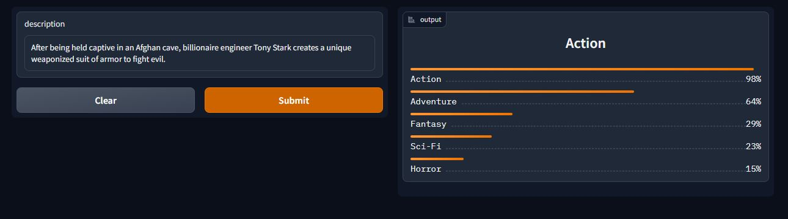
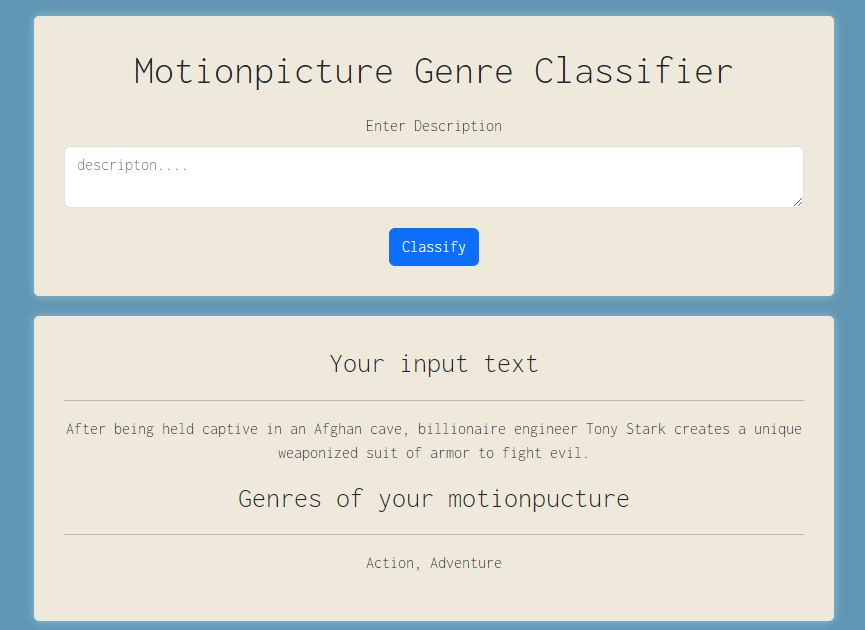

# Multilable-motionpicture-genre-classifier
This is a multilable motionpicture genre classifier project. It can cassify 19 types of genre based on the description of a plot.

**DistilRoberta-Base** model has been fine-tuned on IMDB movie and TV series description. Around 25,000 movie and tv series description has been used to fin-tune the model. Around 88% accuracy was achieved. The model was then converted to ONNX model for optimizing and later quantized by onnx quantifier. The model is deployed on HuggingFace Spaces and on Render as a web app.

## Data
Selenium was used for data scraping. Collected the data from IMDB movie database. About 56,000 data was scraped in multiple genres. Around 25,000 unique data was available after data processing and cleaning. Movies data and TV series data was scraped seperately then cleaned and joined in a single csv file. You can get the combined data [here](https://github.com/sheikhDeep/multilable-motionpicture-genre-classifier/blob/main/data/movies_and_tvseries.csv)

## Model
DistilRoberta-Base from HuggingFace Spaces was fine-tuned by the collected data using Fastai and Blurr. Around 88% accuracy was achieved after fine-tuning the model and F1 score (micro) of 62% was achieved. Converted the model in ONNX format and quantized for making it load faster and usable.

## Model Deployment
The quantized model is deployed on HuggingFace Spaces. It was deployed using Gradle. You can see the model from [here](https://huggingface.co/spaces/sheikhDeep/multilabel-motionpicture-plot-genre-classifier)

 

## Web Deployment
A web app using flask framework was also built and connected to the spaces api. You can find the code in flask-deployment branch. You can also see the live website [here](https://multilable-motionpicture-genre-classifier.onrender.com)

 

## Contributions
You are welcome to contribute to this project. You can fork the repository and submit a pull request, or submit an issue with suggestions for improvements.

## Limitations
The IMDB movie description is very short. More elaborated descrition could diversify the model.

## Future Work
In future I aim to improve the model by collecting more and diverse data from different sources. Different Model architecture can also be explored to test the dataset. I also plan to collect data in different languages to make the model more robust.
